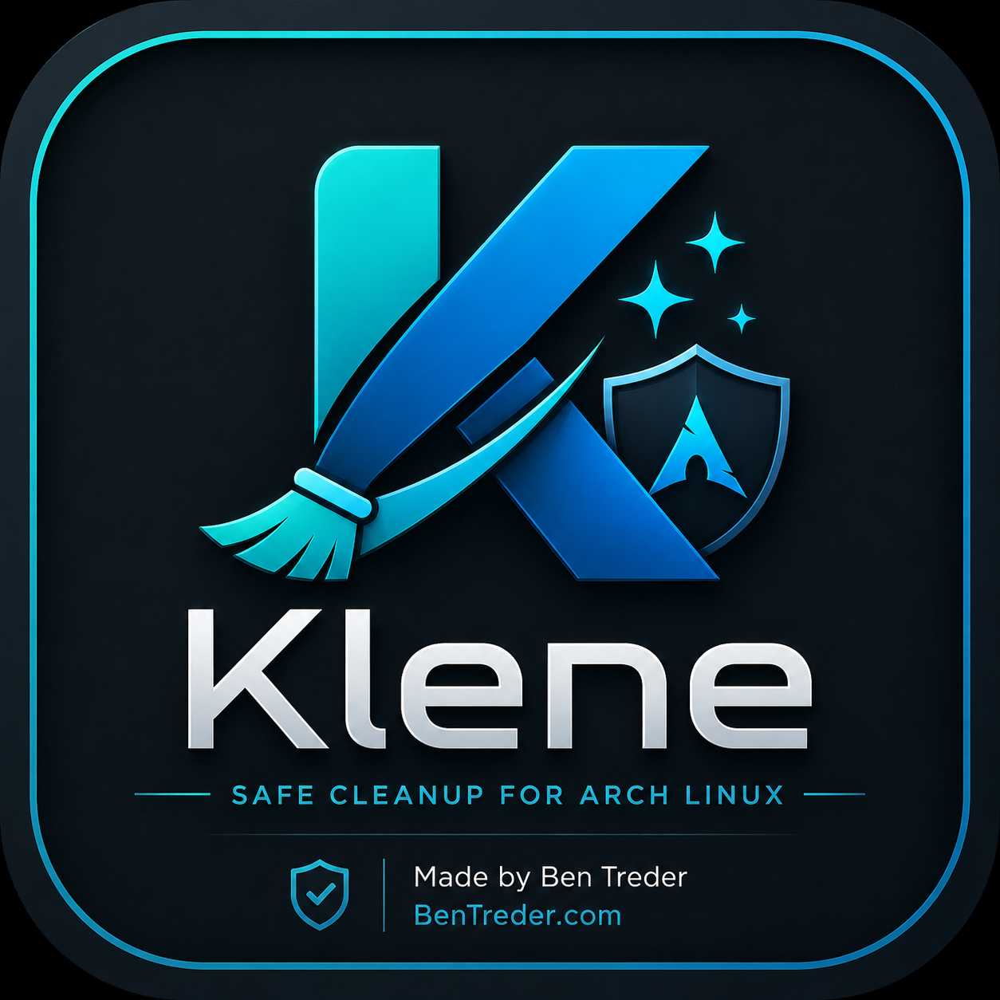

# Klene

Klene is a safe cleanup utility for Arch Linux with a polished GUI and a fast CLI.

It is built to help you review cleanup opportunities clearly before anything is removed. Klene scans first, previews what it found, and keeps real cleanup behind confirmation.



## Why Klene

- Safe by default
- Preview-first cleanup flow
- Modern PySide6 desktop app
- Fast Typer CLI
- Shared backend logic for consistent behavior
- Arch-focused cleanup categories instead of generic guesswork

## Safety First

Klene does not delete anything automatically.

- Cleanup commands default to dry-run mode
- `--execute` is required for real cleanup
- The GUI always asks before cleanup runs
- Orphan package removal gets extra confirmation
- Protected paths are refused
- Broad destructive commands such as `pacman -Scc` are not used as the default path

## Features

- GUI branding with packaged logo and splash screen
- Rich CLI output for scan and doctor commands
- Pacman cache cleanup using `paccache` when available
- Orphan package review using `pacman -Qdtq`
- Journal cleanup support through `journalctl`
- Low-risk user cache cleanup
- Trash and thumbnail cleanup
- yay and paru cache cleanup
- Optional Flatpak cleanup support

## Install From Source

Arch package dependencies:

```bash
sudo pacman -S python pyside6 python-typer python-rich python-pytest pacman-contrib
```

Local development install:

```bash
python -m venv .venv
source .venv/bin/activate
pip install -e ".[dev]"
```

`paccache` comes from `pacman-contrib`:

```bash
sudo pacman -S pacman-contrib
```

## Install Desktop Launcher

For a user-local desktop install:

```bash
./scripts/install-desktop-entry.sh
```

Manual install:

```bash
mkdir -p ~/.local/share/applications ~/.local/share/icons/hicolor/256x256/apps
install -m 644 klene.desktop ~/.local/share/applications/klene.desktop
install -m 644 src/klene/assets/klene_logo.png ~/.local/share/icons/hicolor/256x256/apps/klene.png
update-desktop-database ~/.local/share/applications 2>/dev/null || true
gtk-update-icon-cache ~/.local/share/icons/hicolor 2>/dev/null || true
```

## GUI Usage

```bash
klene
python -m klene gui
```

The GUI starts with a short splash screen, shows the packaged logo, and uses the same scan and cleanup backend as the CLI.

On some Xfce setups, Qt may print harmless portal or theme warnings if `xdg-desktop-portal` services are not running. Klene does not depend on those warnings to function.

## CLI Usage

```bash
klene-cli scan
klene-cli scan --json
klene-cli doctor
klene-cli about
klene-cli clean pacman-cache --dry-run
klene-cli clean pacman-cache --keep 3 --execute
klene-cli clean journal --vacuum-time 14d --dry-run
klene-cli clean all --dry-run
```

Version output:

```bash
klene-cli --version
```

Direct module-based CLI use still works:

```bash
python -m klene --help
```

## Doctor Command

`klene-cli doctor` checks your local setup without cleaning anything.

It reports:

- Arch detection
- pacman, paccache, journalctl, yay, paru, and flatpak availability
- GUI import health
- packaged logo availability
- current user
- common cleanup path availability

## What Klene Cleans

- Pacman cache
- Orphan packages
- System journal logs
- Known low-risk user cache folders:
  - `~/.cache/thumbnails`
  - `~/.cache/fontconfig`
  - `~/.cache/pip`
  - `~/.cache/go-build`
  - `~/.cache/npm`
  - `~/.cache/yarn`
- Trash contents
- Thumbnail cache
- yay cache
- paru cache
- Optional Flatpak unused data cleanup when `flatpak` is installed

## What Klene Refuses To Touch

- `/`
- `/home`
- `~`
- `/usr`
- `/etc`
- `/var`
- `/var/cache`
- `~/.config`
- `~/.ssh`
- `~/Documents`
- `~/Downloads`
- `~/Desktop`
- `~/Pictures`
- `~/Videos`

## Development Setup

```bash
python -m venv .venv
source .venv/bin/activate
pip install -e ".[dev]"
```

Project layout uses a `src/` package structure with shared scanner and cleaner logic used by both the GUI and CLI.

## Local Shortcuts

To make `klene` launch the GUI and `klene-cli` run CLI commands from this project:

```bash
./scripts/install-local-shortcuts.sh
```

After that, common commands are:

```bash
klene
klene-cli scan
klene-cli doctor
```

Make sure `~/.local/bin` is in your `PATH`.

## Screenshots

Add real screenshots to the `screenshots/` directory using names like:

- `Klene_GUI_Dashboard.png`
- `Klene_GUI_Scan_Results.png`
- `Klene_GUI_Preview.png`
- `Klene_GUI_About.png`
- `Klene_Doctor_Command.png`

Do not add placeholder or mock screenshots.

## Testing

```bash
python -m compileall src tests
PYTHONPATH=src python -m pytest
PYTHONPATH=src python -m klene --help
PYTHONPATH=src python -m klene --version
PYTHONPATH=src python -m klene doctor
PYTHONPATH=src python -m klene scan --json
```

## Release Checklist

- Review README and desktop install notes
- Confirm the packaged logo and desktop file still work
- Run compile and test checks
- Run `klene doctor`
- Run `klene scan --json` on a real Arch Linux system
- Verify the GUI launches cleanly
- Tag the release after final manual review

## Credits

Made by Ben Treder  
BenTreder.com
